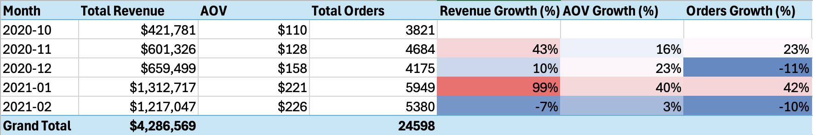
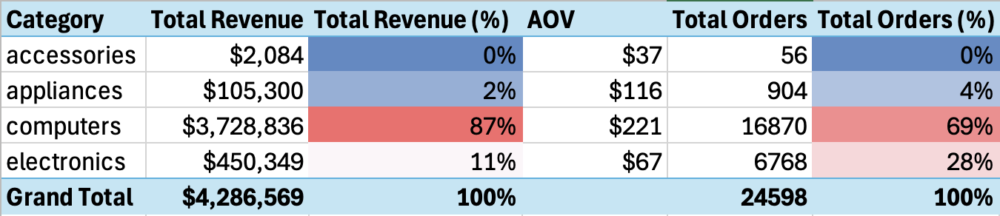
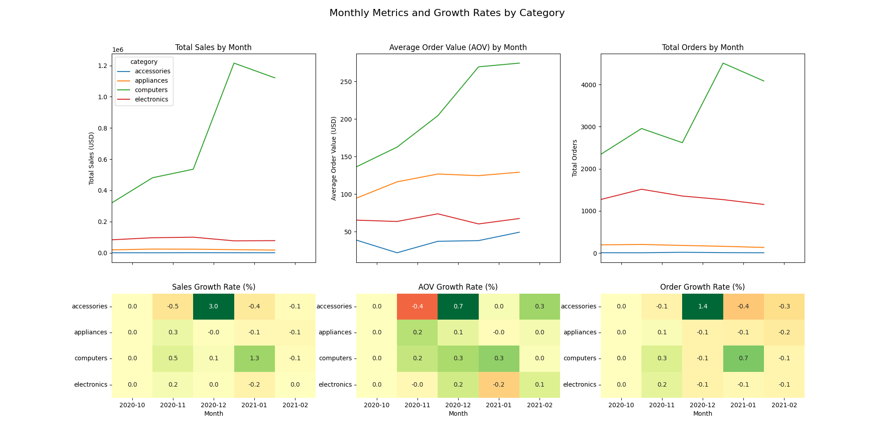
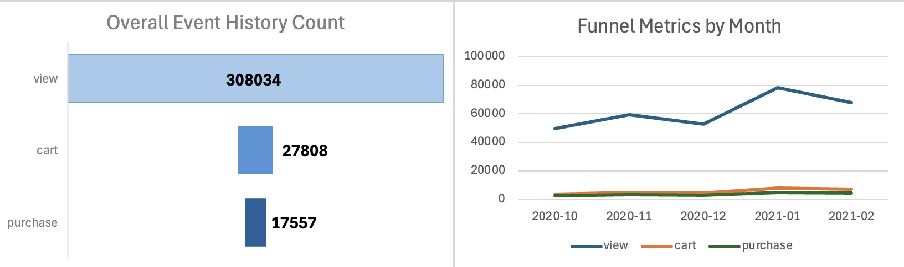
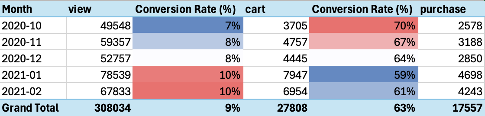
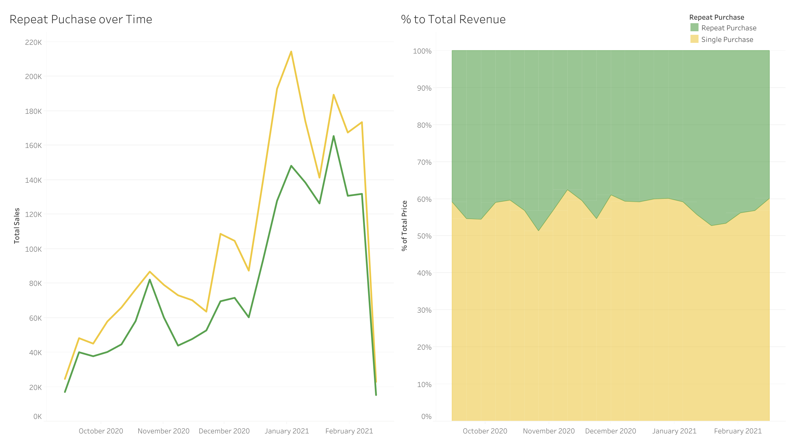
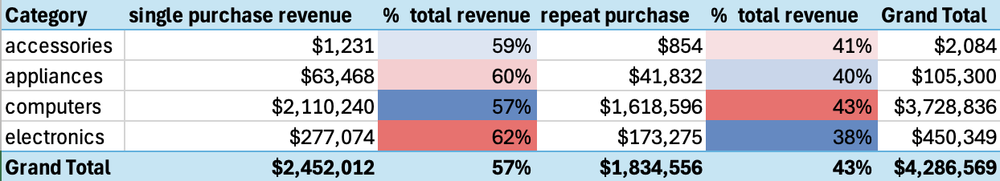

# Electroincs Ecommerce Funnel Analysis
Table of Contents:
- [Project Background](https://github.com/jiayuanshi/Electronics-Ecommerce-Funnel-Analysis?tab=readme-ov-file#project-background)
- [Executive Summary](https://github.com/jiayuanshi/Electronics-Ecommerce-Funnel-Analysis?tab=readme-ov-file#executive-summary)
- [Insights Deep-Dive](https://github.com/jiayuanshi/Electronics-Ecommerce-Funnel-Analysis?tab=readme-ov-file#insights-deep-dive)
    - [Monthly Sales Trends & Growth Rates](https://github.com/jiayuanshi/Electronics-Ecommerce-Funnel-Analysis?tab=readme-ov-file#monthly-sales-trends--growth-rates)
    - [Key Categories Performance](https://github.com/jiayuanshi/Electronics-Ecommerce-Funnel-Analysis?tab=readme-ov-file#key-categories-performance)
    - [Funnel Analysis](https://github.com/jiayuanshi/Electronics-Ecommerce-Funnel-Analysis?tab=readme-ov-file#funnel-analysis)
- [Recommendations](https://github.com/jiayuanshi/Electronics-Ecommerce-Funnel-Analysis?tab=readme-ov-file#recommendations)
- [Assumptions and Caveats](https://github.com/jiayuanshi/Electronics-Ecommerce-Funnel-Analysis?tab=readme-ov-file#assumptions-and-caveats)

## Project Background
In this project, we are going to dive through the datasets of an ecommerce online shop's user event history in electronics field specifically with the purpose of improving budget relocation for sales, product, and marketing. With over 800k instances collected by Open CDP project, we will perform sale trend, funnel, and product analysis with time dimension of 5 months (Oct 2020-Feb 2021). 

## Executive Summary
The store's 5-month records show monthly revenue fluctuating around $0.9 million, with a continuously increasing trend from October 2020 to January 2021 but a slightly decrease in February 2021. Among all categories of product, `computers` has contributed to the greatest proportion of sales, 87%, whereas `electronics` products account for 11% of revenue, ranking in the 2nd. The conversion rate of view to cart has increased from 7% to 10% though the purchase conversion rate has dropped from 70% to 61% could be a potential concern. The store can benefit from expanding top product lines and shifting focuses to frequently viewed products. Targeted improvements to low purchase conversion rate products will drive sustainable growth for the store.

## Insights Deep-Dive
### Monthly Sales Trends & Growth Rates
- The store has acheived $0.8 million in monthly sales with 4919 orders per month.
- The two obvious growths of total revenue has reflected the seasonality of sales, especially in November and Janurary, which corresponds to revenue growth of 43% and 99% (almost doubled!!) respectively.
- During the 5 months, revenue and orders growth fluactuated with different direction but a good sign is that the average order value (AOV) has increased steadily, showing an uptrend in customers' consumption power.

### Key Categories Performance
- Among the four categories, `computers` and `electronics` has contributed to 98% of total revenue.
- `Computers` accounts for 87% of total revenues and 69% of total orders (16870 orders). Simultaneously, it is also the category with highest AOV, $221 per order. 
- There are two peaks in `computers`'s total orders graph -- Nov 2020 and Jan 2021, which can be associated with Black Friday and other factor.
- Although `accessories` only engaged with little revenue and order amount (approximately 0% for both), there's a dramatic increase by growth rates in Dec 2020, showing its popularity in gift selection for fesival.

### Funnel Analysis
- With a smaller peak in Nov 2020, possibly related to Black Friday sales, and a huge increase in Jan 2021, seasonality is reflected with all three types of event history (`view`, `cart`, `purchase`).
- Overall, cart conversion rate increases but purchase conversion rate decreases. On average, cart conversion rate is 9% meanwhile purchase conversion rate is 63%.
- From the perspective of cart conversion rate, overall there's a steady increase from 7% to 10% but with December and Feburary's add-to-cart rate same as previous month (8% and 10% respectively), showing temporary effects of sales events on the following month.
- Even though from Dec 2020 to Jan 2021, total purchase has surged by roughly 65%, purchase conversion rate has reduced from 64% to 59%.

### Single vs Repeat Purchase
- Repeat purhcase has shown a good sign of consistently increasing trend, even thought the percentage to total monthly revenue has decreased a little in Dec 2020.
- Meanwhile, the greatest discrepancy between single and repeat purchase is obtained in Dec 2020, which is 19% and $122,171. 
- Among 4 categories of products we are focusing on, `computers` and `accessories` achieved under 20% difference between single and repeat purchase percentage in monthly total revenue, indicating the potential market in existing customers. 

## Recommendations
### Maximizing Product Offerings
- Expand High-Performing Categories: Increase catalog variations in computers and electronics to meet diverse customer needs, driving repeat purchases and solidifying market presence.
- Respond to Seasonal Sales Events: Promote computers and accessories products corresponding to seasonality and customer consumption habits, ensuring efficient product selection and purchase process.
### Customer Growth
- Boost Purchases after Adding to Cart: Target customers having multiple items added to cart with personalized engagement campaigns to incentivize purchases and improve retention. 
- Encourage Repeat Purchases: Deliver marketing related promotional content for single-purchased customers, especially within `computers` and `accesories` categories during December, further expanding markets among existing customers by increasing recurring customers.

## Assumptions and Caveats
- **Product Categories Selection**
    - Due to our goal of exploring electronics related products only and with consideration of data integrety, the categories successfully passed the quality check are `accessories`, `appliances`,  `computers`, and `electronics`. 
